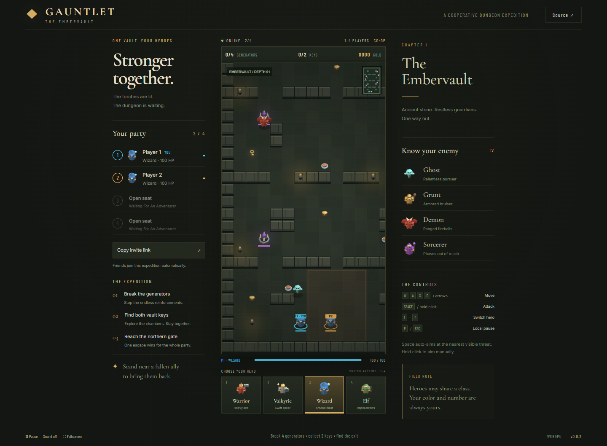
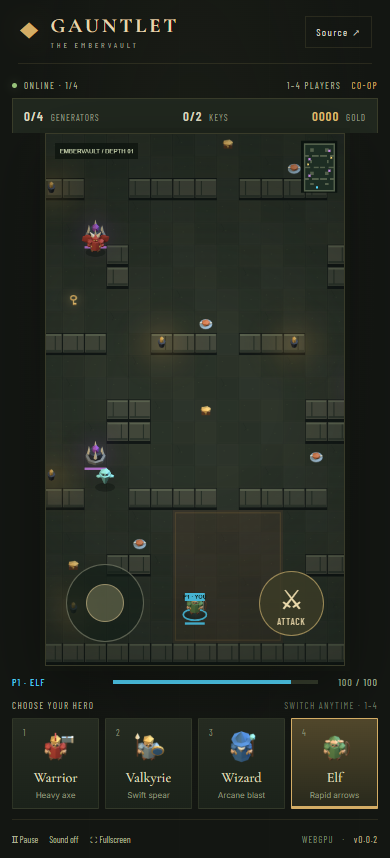
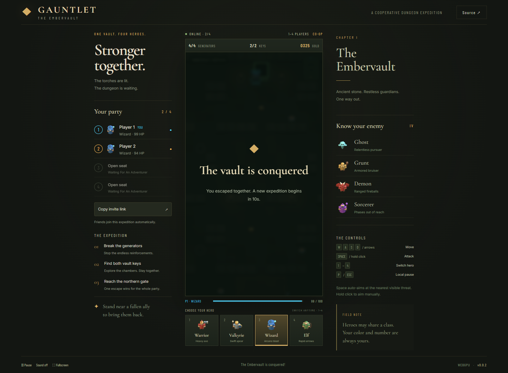

# Gauntlet — Embervault

A complete **1–4 player online cooperative dungeon crawler**, inspired by classic Gauntlet. Hot join your party, switch between Warrior, Valkyrie, Wizard and Elf at any moment, and conquer one handcrafted tile dungeon. Every player keeps a unique color and numbered in-world marker, even when everyone chooses the same class.

## Live Demo

- **[Play Gauntlet — Embervault](https://samuelasherrivello.github.io/babylon-lite-gauntlet-clone-2d/)**
- [Game repository](https://github.com/SamuelAsherRivello/babylon-lite-gauntlet-clone-2d)
- [Shared multiplayer backend](https://github.com/SamuelAsherRivello/rmc-colyseus-multiplayer-server)

## Images

[](project-name/documentation/screenshot.png)

<details><summary>Mobile controls and completed expedition</summary>




## Table of Contents

1. [Getting Started](#getting-started)
2. [Project Details](#project-details)
3. [Credits](#credits)

</details>

## How to Play

Break all **four generators**, find **two vault keys**, and reach the northern exit. One player reaching the unlocked gate wins for the whole party. Ghosts pursue, Grunts absorb more damage, Demons throw fireballs, and Sorcerers phase in and out. Food restores health; treasure contributes to the shared score. Stand near a fallen ally for 2.5 seconds to revive them. Victory or party defeat starts a fresh expedition after ten seconds.

| Input | Action |
|---|---|
| WASD / arrow keys | Move |
| Hold Space | Attack with automatic targeting of the nearest visible threat |
| Hold left mouse button | Aim and attack toward the pointer |
| Four hero buttons / 1–4 | Instantly switch class; health and cooldown are preserved |
| P / Escape / Pause | Pause your controls; other players and enemies continue |
| Touch joystick + Attack | Move and attack simultaneously on mobile |

Warrior has heavy axes; Valkyrie has faster spears; Wizard deals splash damage; Elf runs and shoots fastest. Friendly fire is disabled. Character switching does not change your player number or color. Send the page URL to friends using **Copy invite link**. A full room displays an explicit retry option.

## Getting Started

Use **Node 24**, npm, and a current WebGPU-capable Chrome or Edge with hardware acceleration. Mobile requires a browser/device that actually supports WebGPU. A useful error is shown if graphics initialization fails.

Run commands from the repository root:

```sh
npm ci
npm run dev
npm test
npm run build
npm run preview
```

Vite serves `/babylon-lite-gauntlet-clone-2d/`. The application lives under `project-name/`, retaining the template's application directory and corner roles.

### Multiplayer configuration

Production uses `https://rmc-colyseus-multiplayer-server.vercel.app` and isolated room key `gauntlet-2d`. The lockfile pins **@rmc/multiplayer-client v0.4.0** from its [published release asset](https://github.com/SamuelAsherRivello/rmc-colyseus-multiplayer-server/releases/tag/v0.4.0). That protocol is retained by the deployed **backend v0.5.0**, alongside drawing, sumo, garden and the separate 3D Gauntlet room. No browser secrets are required.

For a local backend, follow its README and set `PORT=2687` before starting it. Copy `.env.example` to `.env.local` and set `VITE_SERVER_URL=http://127.0.0.1:2687`. Local environment files are ignored. Never commit credentials.

The server owns positions, collision, attacks, damage, enemy behavior, generators, pickups, completion and replay. Clients send only bounded movement/aim, attack and class selection. Inputs expire after 300 ms; blur, pause and pointer cancellation release local controls. Joining or refreshing creates a new anonymous identity. There are no accounts or persistent scores.

### Verification

```sh
npm test
npm run build
# Start the local game and backend first, then:
npm run test:browser
```

Browser tests use installed Microsoft Edge, two independent browser contexts, actual WebGPU rendering, keyboard inputs, emulated multitouch, reconnect, unsupported-GPU recovery, a full victory/replay loop and defeat/replay. Set `GAME_URL` to test another deployment. `SKIP_FULL_LOOP=1` runs the shorter smoke/layout checks. Public capacity tests require otherwise empty sessions; avoid running multiple capacity suites at once. See [verification evidence](project-name/documentation/verification.md).

### Release

`version.txt` is the only game version source. **Release** in GitHub Actions installs dependencies, tests, builds, increments its patch number, commits, tags and publishes a GitHub Release. **Deploy live demo** builds and deploys GitHub Pages. Explicitly dispatch Pages after Release because a bot-generated version commit may not trigger another workflow. Verify the public game and version, then fast-forward the local checkout. No pull request is required by this workflow.

## Project Details

- `project-name/src/`: browser UI, safe input handling, catalog and Babylon Lite renderer.
- `project-name/public/art/`: 15 original transparent Blender PNG sprites.
- `project-name/art-source/`: reproducible Blender Python source and editable `.blend` scene.
- `project-name/test/`: asset/input contracts and real-browser gameplay checks.
- `project-name/documentation/`: genuine game screenshots, art reference and evidence.
- `openspec/`: separate explored/applied multiplayer, combat, rendering and UI changes.
- `.agents/skills/`: imported shared-library and Blender Codex skills as real project files.

Babylon Lite **1.25.0** renders the composited tile scene through a dynamic WebGPU texture and a 2D sprite layer. The scene combines original Blender-rendered sprites with procedural stone tiles, torch light, color rings, health bars and a complete-level minimap. This uses Babylon Lite, not the full Babylon.js distribution. Vite bundles the static site; the separate Colyseus service runs authoritative rules at 30 Hz with 20 Hz snapshots. No simulation is silently substituted when disconnected.

### Art and skill provenance

[Provenance](project-name/documentation/provenance.md) records the exact template, shared skills and Blender skill revisions. All runtime art is original. Blender 5.2.2 LTS produced the transparent orthographic miniatures; a generated concept image guided silhouettes and palette. It is labeled separately from actual renders and screenshots. No Gauntlet game assets were extracted.

### Known limits

The shared backend is an experimental in-memory service hosted on Vercel. Hosting may interrupt sessions around five minutes; reconnect creates a fresh player and a server restart loses dungeon progress. Multiple hosted instances do not provide guaranteed cross-instance room sharing. Deployments can disconnect players. A local pause cannot freeze a cooperative server, so enemies may still hurt your hero. Physical touch hardware was not tested; multitouch was emulated in a real browser.

## Original AI Prompt

<details><summary>Original game request and follow-up</summary>

```text
$rmc-game-creator Create a new MULTIPLAYER game in a public repo.
Using this template: https://github.com/SamuelAsherRivello/github-repository-template

Import these codex skills to use to make art https://github.com/SamuelAsherRivello/ai-skills-blender/

This is a 2d version of the top-down classic game Gauntlet.

https://en.wikipedia.org/wiki/Gauntlet_(1985_video_game)

Remake: https://store.steampowered.com/app/258970/Gauntlet_Slayer_Edition/

Have one complete level with 4 enemies taken from the real game.

Its 2d, topdown view. Create your own sprites for the game for tilebased play.

Offer 4 selectable characters. The player hot joins, then on the ui there are 4 buttons for them to instantly switch to nother player.

The game supports 1-4 players. Dynamically color each player or its in-world ui on th eplayer a unique color so 2+ players can choose the same character yet still distinguis themselves arpart.
```

Follow-up:

```text
import these skills and use the explore and apply for each major system in the game. https://github.com/SamuelAsherRivello/ai-skills-library/. Optional is to use other skills too.
```

</details>

Interpretation: cooperative online play; four enemy **types** with multiple instances; a new original level and artwork; class selection is independent of player identity. The original Gauntlet and Slayer Edition are gameplay references. This is an unofficial fan-inspired portfolio game, not an official Gauntlet product.

## Credits

- Created from [GitHub Repository Template](https://github.com/SamuelAsherRivello/github-repository-template).
- Gameplay inspiration: [Gauntlet (1985)](https://en.wikipedia.org/wiki/Gauntlet_(1985_video_game)) and [Gauntlet: Slayer Edition](https://store.steampowered.com/app/258970/Gauntlet_Slayer_Edition/).
- Samuel Asher Rivello — Over 25 years of game development XP (2026).
- [LinkedIn.com/in/SamuelAsherRivello](https://Linkedin.com/in/SamuelAsherRivello) ⭐
- [GitHub.com/SamuelAsherRivello](https://github.com/SamuelAsherRivello/)
- [Twitter.com/srivello](https://twitter.com/srivello/)
- Resume / Portfolio: [SamuelAsherRivello.com](http://www.SamuelAsherRivello.com)
- Provided as-is under the [MIT License](LICENSE). Copyright © 2026 Rivello Multimedia Consulting, LLC.
